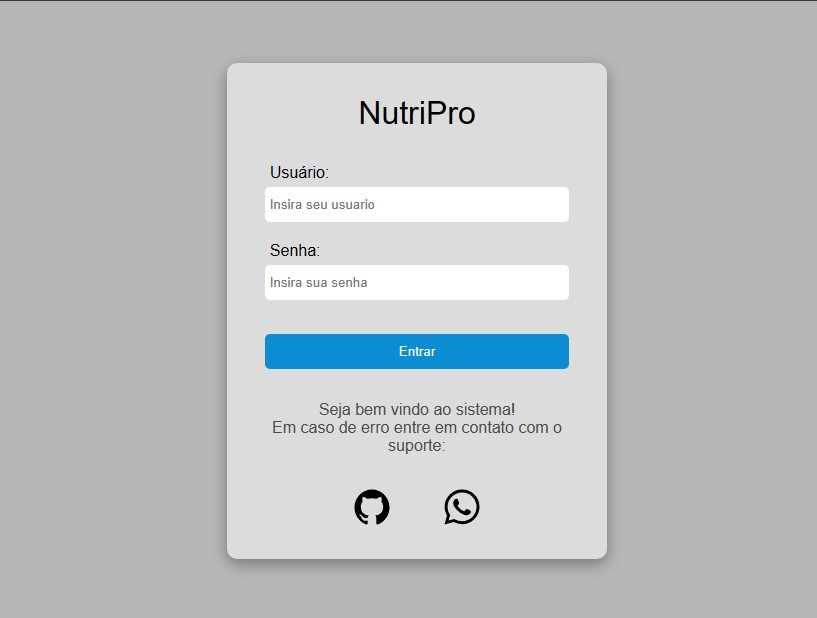

<h1 align="center">NutriPro</h1>

  Projeto feito para validação de conhecimentos adquiridos.

  

## 🚀 Tecnologias

Esse projeto foi desenvolvido com as seguintes tecnologias:

- HTML e CSS
- JavaScript

## 💻 Projeto

- O Projeto NutriPro, foi feito para validação de conhecimentos, adquiridos no curso de JavaScript do Alura.
